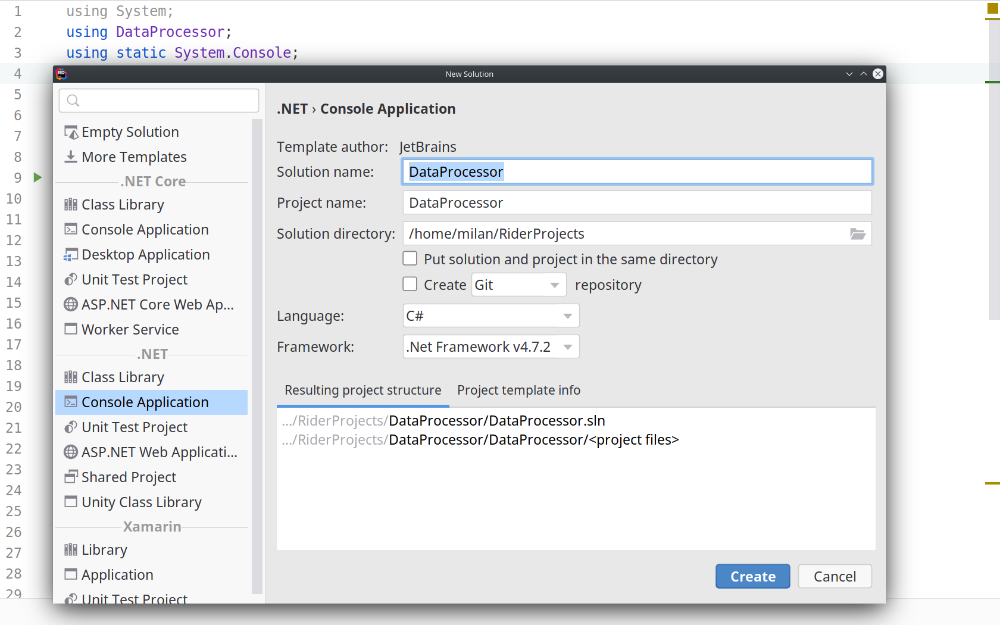
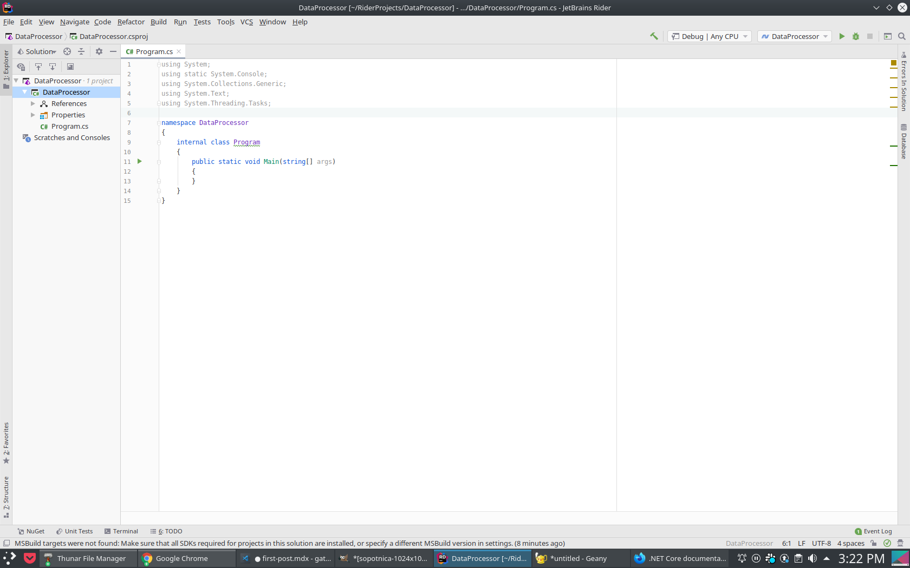
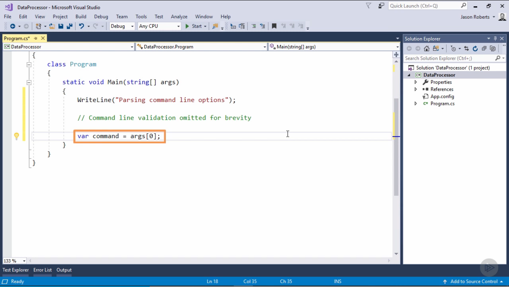
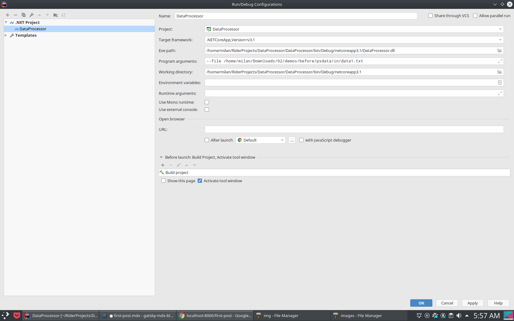
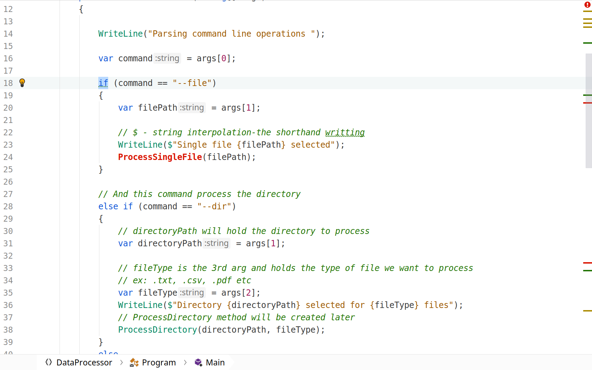
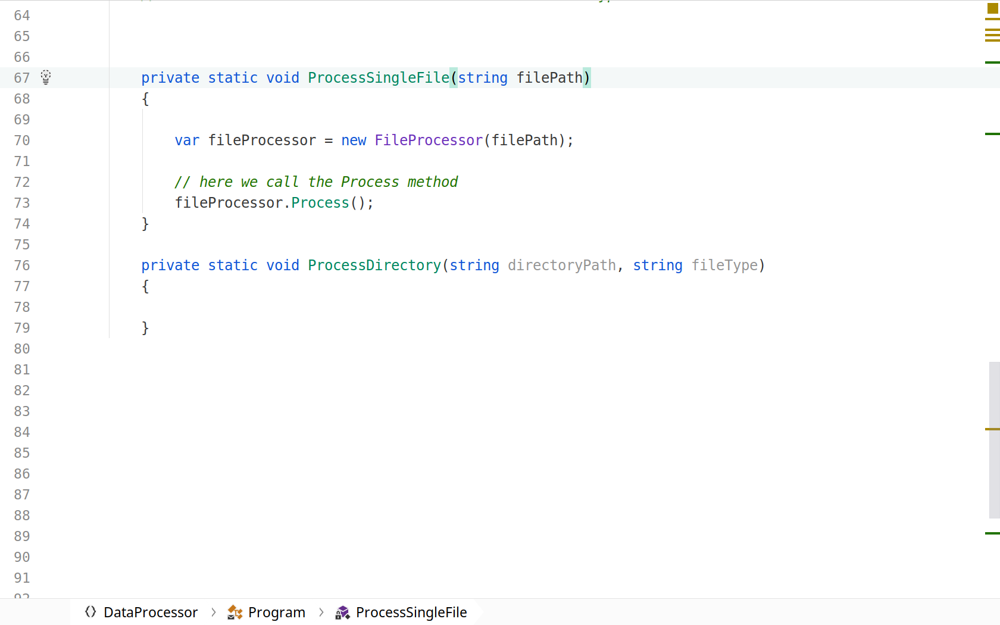

# Working with Files in C#

Have you ever wonder what happens under the hood when we create new folder or delete it? How system handles copy/cut/paste and delete of the files? 
Well, in this post we will dwelve into it thanks to amazing Pluralsight course 'Working with Files and Streams in C#' by Jason Roberts. Let's start.

1. **Create a new console app**

2. **What the heck is the Main**

The Main method is the entry point of a C# application. 
When the application is started, the Main method is the first method that is invoked and there can only be one entry point in a C# program.

3. **Explanation of the args[0]**

Args ( or arguments ) are passed by command line are known as command line arguments. We can send arguments to the Main method while executing the code.The string args variable contains all the values passed from the command line. Have in mind that it is an array [] and that arrays are zero-based which means we count items inside them from zero. In this case args[0] is the first item.

4. **What is the '--file'**

 

--file is the way which allows us to process the particular file (data1.txt in our example). It is an argument that we pass in the Debug configuration.

In the Program arguments field we pass the --file and then the path to our txt file. Please keep in mind that your setup may be different than mine because I use Arch Linux operatin system and JetBrains Raider as IDE. We will be passing two values in our command variable, the --file and --dir which process the directory where our txt file may be placed. The very first thing is to check if the txt file and directory exists. We can manage that with IF block statement.

If the command is equal to "--file" the we need the second item in an array which will hold the path to the file. in our case var filePath will hold that value. Please don't bother yourself too much with args[0], args[1] etc. at this point. Just keep in mind that they are the values from an array that are taken from console as our application executes.

In the picture above we can also see inside WriteLine method the $ operator. As comments says it is string interpolation which is just a fancy word to say that with $ operator we can write with less code. 
So if we write Console.WriteLine($"Hello {variable}"); it is equal to Console.WriteLine(string.Format("Hello {0}, variable")). Same applies in our case.
After executing WriteLine method next we activate ProcessSingleFile method which we'll discus later. In ELSE IF block we do pretty much the same as in the IF block. only addition is the fileType variable which holds, off course the type of our file or extension in other words (.txt, .csv, .pdf etc). And at the end of our Main method we ask user politely to press enter to quit the app. 

Side note: 

 

following ReadLine method will pause the execution of the app until the user presses the Enter key. This is important because without it application will just pop up in console window end close an we won't be able to see the output. If you are having trouble with such issue you can use Thread.Sleep(2000) method which holds the console window opened for 2000ms. In order to use it you will need to import it with using statement at the top like this: using System.Threading;

5. **Private, static and void keywords** 

First of all notice that our ProcessSingleFile method accepts one parameter of type string (filePath) which we met earlier in the code.
The private keyword is a member access modifier. Private members are accessible only within the body of the class, in this case only inside our class Program. Static modifier makes an item non-instantiable, it means the static item cannot be instantiated or created in other words. If the static modifier is applied to a method then it can be accessed without creating an object of the class. While creating our methods we mention whether a method has to return something after executing the block of code enclosed in it or not (Void). In some cases we just need the methods to execute the code but not return anything back to the method call then we mention the return type as Void.
We will discus this topics in the following blog posts. 

6. **The new keyword**

 

We create an instace of the FileProcessor class with the new keyword. We use the new keyword to instantiate a class instance. We combine the new keyword with the type name and its constructor arguments to create a new instance of the type. Putting it simple we make new instace (object) with new keyword (or command if you like).After creating we call the method with the fileProcessor.Process() command. 

7. **Where is this FileProcessor method** 

 

FileProcessor method is in the separate file FileProcessor.cs and the reason is to keep our code clean and easy to read. Imagine if all the code is in one single file. We would need to read 1000 lines of code to find the part we are interested in. This way we maintain our code and keep it readable.

8. **What's next**

 

In the next blog post we will discus ProcessSingleFile method.

